# 部署与监控接入记录

# 目录

# 目录

- [一、环境概览](#一环境概览)
  - [1.1 硬件环境](#11-硬件环境)
  - [1.2 网络拓扑](#12-网络拓扑)
  - [1.3 关键决策：推理节点与监控节点的选型理由](#13-关键决策推理节点与监控节点的选型理由)
- [二、架构设计](#二架构设计)
  - [系统架构图](#系统架构图)
  - [设计决策](#设计决策)
- [三、部署过程](#三部署过程)
  - [3.1 概述](#31-概述)
  - [3.2 阶段一：监控节点系统与 Docker 环境](#32-阶段一监控节点系统与-docker-环境)
    - [监控节点系统环境准备（简述）](#监控节点系统环境准备简述)
    - [docker 环境准备（简述）](#docker-环境准备简述)
    - [排障记录1：Docker Compose Plugin 安装失败](#排障记录1docker-compose-plugin-安装失败)
  - [3.3 阶段二：监控节点 Prometheus + Grafana 部署](#33-阶段二监控节点-prometheus--grafana-部署)
    - [3.3.1 创建项目目录与 compose 文件](#331-创建项目目录与-compose-文件)
    - [3.3.2 排障记录2：镜像拉取超时](#332-排障记录2镜像拉取超时)
  - [3.4 阶段三：推理节点 GPU 环境与 Exporter](#34-阶段三推理节点-gpu-环境与-exporter)
    - [3.4.1 WSL2 环境安装](#341-wsl2-环境安装)
    - [3.4.2 Docker 环境安装](#342-docker-环境安装)
    - [3.4.3 排障记录3：NVIDIA Container Toolkit 安装失败](#343-排障记录3nvidia-container-toolkit-安装失败)
    - [3.4.4 排障记录4：DCGM Exporter 端口映射错误](#344-排障记录4dcgm-exporter-端口映射错误)
    - [3.4.5 排障记录5：Prometheus 采集配置与 Grafana 数据源](#345-排障记录5prometheus-采集配置与-grafana-数据源)
  - [3.5 备份](#35-备份)
- [四、总结与下一步计划](#四总结与下一步计划)
  - [4.1 经验提炼](#41-经验提炼)
  - [4.2 下一步计划](#42-下一步计划)

## 一、环境概览

### 1.1 硬件环境

| 项目 | 配置 |
|------|------|
| 物理机 | 笔记本，i5-12700H，16GB DDR4，RTX 3050Ti 4GB，Windows 11 |
| 监控节点 | VMware虚拟机，Ubuntu Server 22.04，4GB内存，2核CPU |
| 推理节点 | WSL2 Ubuntu 22.04，直通物理机GPU（4GB显存） |

---

### 1.2 网络拓扑

| 节点 | IP | 说明 |
|------|-----|------|
| 监控节点（虚拟机） | 192.168.3.10 | 桥接模式，与物理机同网段 |
| 推理节点（WSL2） | 172.31.34.84 | NAT模式，需通过宿主机端口转发访问 |
| 物理机（宿主机） | 192.168.3.8 | 作为WSL2的流量转发入口 |

> **网络说明**：笔记本在不同WiFi下IP会变动（192.168.3.x ↔ 192.168.1.x），后续排障中会涉及对应的配置调整。

---

### 1.3 关键决策：推理节点与监控节点的选型理由

**监控节点选型（VMware）**

监控栈其实可以直接部署在Windows物理机上（Docker Desktop for Windows），网络配置更简单，也不需要额外开一台虚拟机。
但我选择在VMware虚拟机里部署监控栈，原因很直接：

| 考量 | 说明 |
|------|------|
| 练手目的 | 我刚接触Linux运维，想通过实际动手熟悉命令行操作、网络配置、systemd、文件权限等基本功 |
| 架构预演 | 未来生产环境中监控节点大概率跑在独立服务器或云主机上，提前习惯“远程Linux节点”的操作方式 |
| 资源隔离 | 监控栈与推理服务分属不同节点，模拟真实集群的分布式部署 |

**推理节点选型（WSL2）**

| 方案 | 结果 |
|------|------|
| VMware虚拟机 + GPU虚拟化 | 消费级显卡无法直通，且虚拟化方案会导致显卡被独占，无法被宿主机使用 |
| WSL2 + GPU直通 | 一行命令启用，直接使用物理显卡，无额外虚拟化开销 |

> 代价：多了一台虚拟机的资源开销和网络配置复杂度。
> 权衡：为了练手和架构预演。

---

## 二、架构设计

### 系统架构图
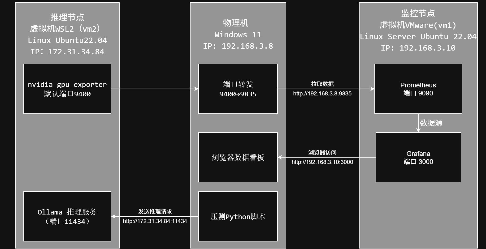

### 设计决策

| 决策 | 选择 | 理由 |
|------|------|------|
| 监控节点OS | Ubuntu Server 22.04 LTS | 5年支持期，Server版无GUI节省资源 |
| 推理节点OS | WSL2 Ubuntu 22.04 | VMware消费级显卡无法直通，WSL2官方支持GPU直通 |
| 虚拟化方案 | VMware Workstation Pro | 个人免费，桥接网络配置直观 |
| 服务部署方式 | Docker Compose | 配置可版本管理，方便迁移，避免依赖问题 |
| Prometheus与Grafana部署 | 同机部署 | 项目规模小，单机足够，未来可按需拆分 |
| 监控与推理服务 | 分属不同节点 | 资源隔离，模拟分布式部署 |
| 网络模式 | 桥接 + 端口转发 | 监控节点桥接直连，WSL2 NAT通过宿主机转发GPU指标 |

压测脚本放在物理机（Windows）上，直接向WSL2的Ollama服务（172.31.34.84:11434）发起请求，而非通过虚拟机或Docker容器运行。减少网络转发层级，避免引入额外延迟干扰压测结果。

---

## 三、部署过程

### 3.1 概述

整个部署分为四个阶段：

| 阶段 | 内容 | 状态 |
|------|------|------|
| 阶段一 | 监控节点（vm1）系统与Docker环境 | 完成，含2个排障 |
| 阶段二 | 监控节点 Prometheus + Grafana 部署 | 完成，含1个排障 |
| 阶段三 | 推理节点（WSL2）GPU环境与Exporter | 完成，含3个排障 |

下文只记录部署中的**关键步骤**和**排障过程**。常规安装操作（Ubuntu系统安装、基础工具安装）不重复赘述。

---

### 3.2 阶段一：监控节点系统与Docker环境

#### 监控节点系统环境准备（简述）

- VMware Workstation Pro 安装 Ubuntu Server 22.04 LTS（最小化安装）
- 分配 4GB 内存、2核CPU、50GB动态硬盘
- 网络桥接模式，固定IP：192.168.3.10
- 安装基础工具：`vim curl wget net-tools iputils-ping`
- 拍摄快照作为回滚点


> **知识学习**：
> - 电脑限制和百科写了最低配置2核+4G缓存+25GB足够，现在填50GB内存备用，https://baike.baidu.com/item/Ubuntu%2022.04%20LTS/60934180
> - 虚拟机的网络适配器配置中：   
  >   1.桥接模式：
    直接连接物理网络，与物理机同地位（另外子选项“复制物理网络连接状态”指的是要不要同步物理机真实联网状态，如物理机断网就一起断网），虚拟机可以联网；    
  >   2.NAT模式：共享主机的IP地址，外部电脑想要连接虚拟机必须先连到物理机，才能连接到虚拟机的地址，虚拟机转到了物理机背后，虚拟机可以联网；  
  >   3.仅主机模式：与主机共享的专用网络，外部设备连接不到虚拟机，只能虚拟机和物理机通信，主要用于内部安全测试，虚拟机不能联网。  
  >   4.自定义：“VMnet0 (自动桥接)”相当于给虚拟机装网卡，类似桥接模式。“LAN区段 (LAN Segment)”可以创建个独立网络（比如lan1），指定哪些虚拟机“私聊”，除他们自己之外谁都连不到。

#### docker环境准备（简述）

Docker是什么?
> - Docker查了像是一个免安装打包好的exe程序，内部自带所有需要的依赖等文件，非常的方便和轻量快速。
> - 主要几个概念——image(镜像)从仓库里下载的就是这个，是个只读文件，里面有程序运行需要的一切，从环境到执行一条龙；container(容器)，当运行镜像就会创建一个独立运行对象，像是python类产生的对象，各自独立但内部又相同；registry(仓库)跟github类似专门存放镜像的公共仓库，可以下载来用。
> - 优点：快、方便部署、隔离。
> - 注意：不能在32位环境运行；还要考虑运行数据的存储，否则Docker运行数据会随生命周期直接消失。

安装Docker：
```bash
# 1. 更新软件源
sudo apt update

# 2. 安装 Docker 引擎和 Compose 插件
sudo apt install docker.io docker-compose-plugin -y
```

##### 排障记录1：Docker Compose Plugin 安装失败

**现象**：
```bash
sudo apt install docker.io docker-compose-plugin -y
# 报错：Unable to locate package docker-compose-plugin
```

**排查过程1——检查源**：

检查拼写和更新apt都不行，应该ubuntu里没有，我询问AI发现说是在Docker自己的官方源里

**排查过程2——添加源docker.io和密钥**：

添加 Docker 官方源，GPG 密钥下载成功
```
# 1. 安装必要的工具（curl 和 gpg）,以及下载密钥，添加 Docker 的稳定版软件源
sudo apt update 
sudo apt install curl gnupg -y
curl -fsSL https://download.docker.com/linux/ubuntu/gpg | sudo gpg --dearmor -o /usr/share/keyrings/docker-archive-keyring.gpg
echo "deb [arch=$(dpkg --print-architecture) signed-by=/usr/share/keyrings/docker-archive-keyring.gpg] https://download.docker.com/linux/ubuntu $(lsb_release -cs) stable" | sudo tee /etc/apt/sources.list.d/docker.list > /dev/null

# 2. 并安装 Docker CE 引擎 + Compose 插件
sudo apt update
sudo apt install docker-ce docker-ce-cli containerd.io docker-compose-plugin -y
```

失败
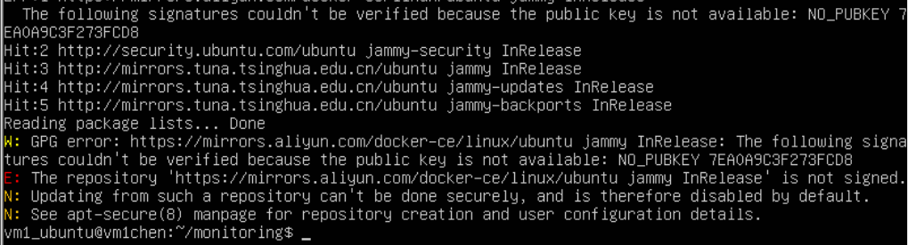
换了阿里源下载密钥也是一样，很有可能跟源无关，我点击docker网站上密钥日期也很新，有可能是系统本身问题，比如不能访问或者读取不了

报错内容
```
W: GPG error: https://mirrors.aliyun.com/docker-ce/linux/ubuntu jammy InRelease: 
   The following signatures couldn't be verified because the public key is not available: 
   NO_PUBKEY 7EA0A9C3F273FCDB8
E: The repository 'https://mirrors.aliyun.com/docker-ce/linux/ubuntu jammy InRelease' is not signed.
```

**排查过程3——换密钥并更改密钥文件权限**：

rm删掉密钥的文件夹，重新sudo权限下载之后chmod a+r gpg密钥，最后重试
```
#删除密钥
sudo rm -r /usr/share/keyrings

sudo mkdir -p /usr/share/keyrings

curl -fsSL https://mirrors.aliyun.com/docker-ce/linux/ubuntu/gpg | sudo gpg --dearmor -o /usr/share/keyrings/docker-aliyun-keyring.gpg

#修改权限
sudo chmod a+r /usr/share/keyrings/docker-aliyun-keyring.gpg

# 添加阿里云的Docker源（引用阿里云的密钥）
echo "deb [arch=$(dpkg --print-architecture) signed-by=/usr/share/keyrings/docker-aliyun-keyring.gpg] https://mirrors.aliyun.com/docker-ce/linux/ubuntu $(lsb_release -cs) stable" | sudo tee /etc/apt/sources.list.d/docker-aliyun.list > /dev/null

# 更新源
sudo apt update

# 安装 Docker 引擎和 Compose 插件
sudo apt install docker-ce docker-ce-cli containerd.io docker-compose-plugin -y
```

**最终定位：系统无法正确读取 GPG 密钥文件**

**结果验证**
```bash
# 验证是否装好
docker compose version
```
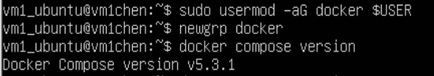   
AI和网上都说v2比较多，版本v5.3.1（2026年8月），官网确认无误
https://docs.docker.com/compose/install/linux/#install-the-plugin-manually
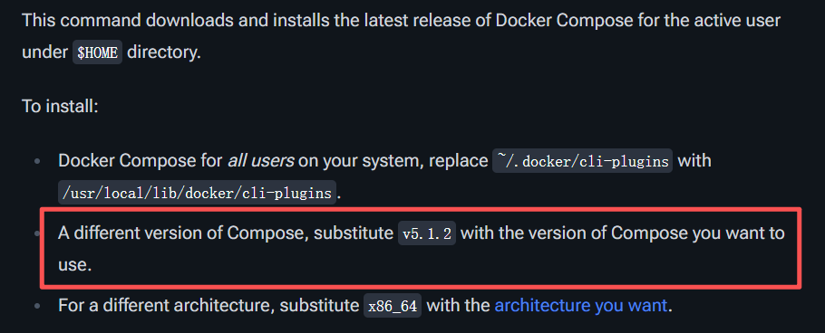

### 3.3 阶段二：监控节点 Prometheus + Grafana 部署

#### 3.3.1 创建项目目录与 compose 文件

```bash
mkdir -p ~/monitoring && cd ~/monitoring
```
创建 docker-compose.yml：
```yaml
services:
  prometheus:
    image: prom/prometheus:latest
    container_name: prometheus
    ports:
      - "9090:9090"
    volumes:
      - ./prometheus.yml:/etc/prometheus/prometheus.yml
      - prometheus_data:/prometheus
    restart: unless-stopped

  grafana:
    image: grafana/grafana:latest
    container_name: grafana
    ports:
      - "3000:3000"
    volumes:
      - grafana_data:/var/lib/grafana
    restart: unless-stopped

volumes:
  prometheus_data:
  grafana_data:

```

同时创建初始 prometheus.yml,其中15s是监视间隔，可以看需求1s或2s：
```yaml
global:
  scrape_interval: 15s

scrape_configs:
  - job_name: 'prometheus'
    static_configs:
      - targets: ['localhost:9090']
```
尝试启动
```bash
docker compose up -d
```

#### 3.3.2 排障记录2：镜像拉取超时

报错：镜像拉取超时
换了几个发现原来很多镜像站都关闭了，找到一个可用的
```bash
sudo tee /etc/docker/daemon.json <<-'EOF'
{
  "registry-mirrors": ["https://docker.m.daocloud.io"]
}
EOF

sudo systemctl daemon-reload
sudo systemctl restart docker

#重试
cd ~/monitoring
docker compose up -d
```
多试了几次 docker compose up -d，每次都能续传一部分，反复执行 3-4 次后，镜像终于全部拉取完成

**注意**：如果中间按了 Ctrl+C 强制退出，或者想彻底重来，需要先清理残留：
```bash
cd ~/monitoring
docker compose down -v --remove-orphans
docker rmi prom/prometheus:latest
docker rmi grafana/grafana:latest
docker system prune -f
```
**结果验证**
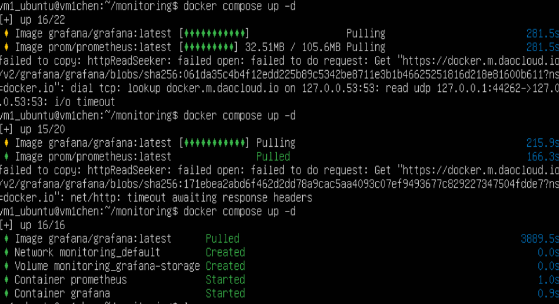

浏览器访问 http://192.168.3.10:3000，默认账号 admin/admin，登录后提示修改密码，进入 Grafana 主界面：
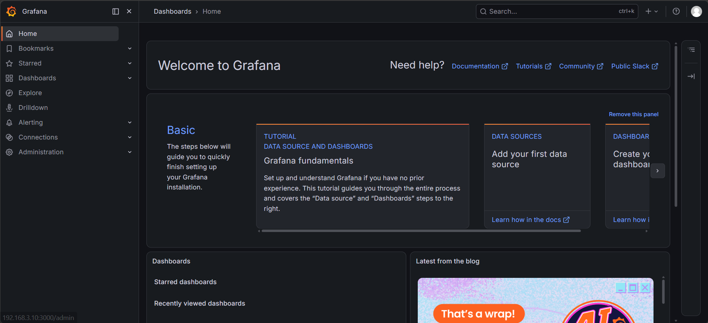

监控节点骨架已立起来。Prometheus（9090）和 Grafana（3000）均运行在 vm1 上，后续只需添加采集目标即可接入 GPU 指标。

**快照存档，用于回滚**

---

### 3.4 阶段三：推理节点 GPU 环境与 Exporter

#### 3.4.1 WSL2 环境安装

管理员运行 PowerShell：

```powershell
wsl --install -d Ubuntu-22.04
```
**注意**：wsl --install 默认安装最新版本，当时装成了 Ubuntu 26.04，为了与监控节点保持一致（22.04），我重装为 22.04 版本。


安装完重启
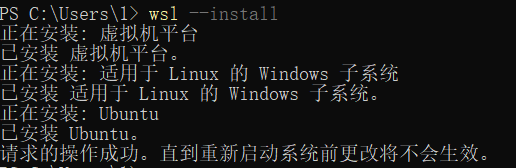
输入用户名和密码
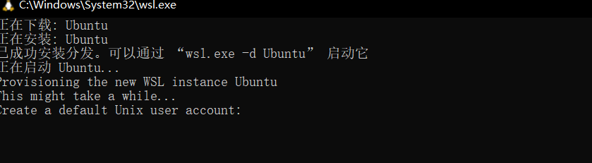
再开个命令行更新wsl，输入wsl --update更新下，更新完输入wsl启动

验证显卡直通
```bash 
nvidia-smi
```
显卡信息，代表可以直接用真实物理显存4G
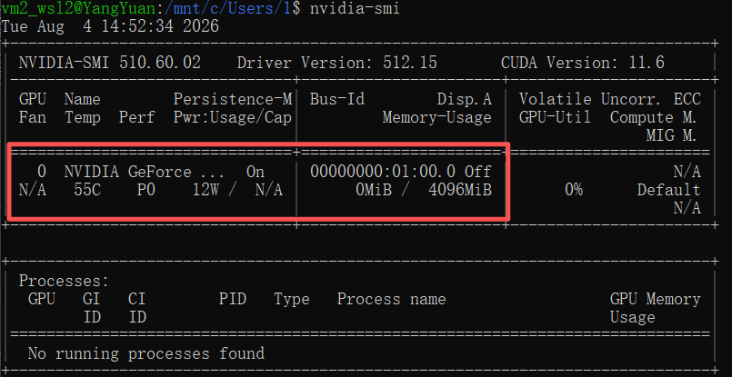

验证网络：
```bash
ip addr show eth0 | grep inet
```
发现 WSL2 的IP是 172.31.34.84（NAT 网络），而非物理机 IP 192.168.3.8。这意味着监控节点（vm1）无法直接访问 WSL2，后续需要通过端口转发解决。
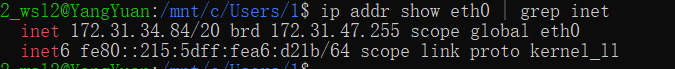

在物理机 Windows 上，以管理员身份打开 PowerShell
```bash
# 配置端口转发：将 WSL2 的 GPU Exporter 暴露到物理机
netsh interface portproxy add v4tov4 listenport=9835 listenaddress=192.168.3.8 connectport=9835 connectaddress=172.31.34.84

# 放行 Windows 防火墙
netsh advfirewall firewall add rule name="Allow WSL2 9835" dir=in action=allow protocol=TCP localport=9835

# 一并转发 Ollama 推理服务端口（后续压测使用）
netsh interface portproxy add v4tov4 listenport=11434 listenaddress=192.168.3.8 connectport=11434 connectaddress=172.31.34.84
```


#### 3.4.2 Docker 环境安装
与 vm1 相同的方式安装 Docker：
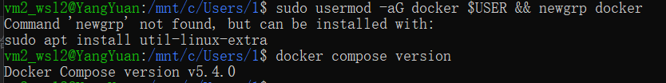

#### 3.4.3 排障记录3：NVIDIA Container Toolkit安装失败
安装NVIDIA Container Toolkit（让Docker容器能访问GPU）时，apt update无法找到对应的包。

**排查过程**：
NVIDIA Container Toolkit 不在 Ubuntu 默认源中，需要手动添加 NVIDIA 的APT源
```bash
curl -fsSL https://nvidia.github.io/libnvidia-container/gpgkey | sudo gpg --dearmor -o /usr/share/keyrings/nvidia-container-toolkit-keyring.gpg
curl -s -L https://nvidia.github.io/libnvidia-container/stable/deb/nvidia-container-toolkit.list | \
sed 's#deb https://#deb [signed-by=/usr/share/keyrings/nvidia-container-toolkit-keyring.gpg] https://#g' | \
  sudo tee /etc/apt/sources.list.d/nvidia-container-toolkit.list
```

执行后报错，GPG 密钥下载超时/失败（被墙）

尝试手动下载密钥：

在浏览器中打开 https://nvidia.github.io/libnvidia-container/gpgkey，将内容（-----BEGIN PGP PUBLIC KEY BLOCK----- 到 -----END PGP PUBLIC KEY BLOCK-----）复制下来。

在 WSL2 中创建密钥文件并转换：
```bash
cat > /tmp/nvidia-gpgkey << 'EOF'
（粘贴浏览器中复制的内容）
EOF

sudo gpg --dearmor -o /usr/share/keyrings/nvidia-container-toolkit-keyring.gpg < /tmp/nvidia-gpgkey
```

添加软件源：
```bash
curl -s -L https://nvidia.github.io/libnvidia-container/stable/deb/nvidia-container-toolkit.list | \
  sed 's#deb https://#deb [signed-by=/usr/share/keyrings/nvidia-container-toolkit-keyring.gpg] https://#g' | \
  sudo tee /etc/apt/sources.list.d/nvidia-container-toolkit.list
```
对齐系统时间（防止因时间偏差导致签名验证失败）：
```bash
sudo timedatectl set-ntp true
```
**最终成功**
```bash
sudo apt update
sudo apt install -y nvidia-container-toolkit
sudo service docker restart
```

#### 3.4.4 排障记录4：DCGM Exporter 端口映射错误

为了让Prometheus（在 vm1 上）能采集GPU指标，需要在WSL2上运行一个Exporter，将GPU指标暴露为Prometheus可拉取的格式

**问题：第一次尝试超时**
```bash
sudo docker pull nvcr.io/nvidia/k8s/dcgm-exporter:latest
sudo docker run -d --gpus=1 -p 9835:9835 --name nvidia-exporter nvcr.io/nvidia/k8s/dcgm-exporter:latest
```
拉取镜像时的额外问题：nvcr.io 同样存在国内访问慢的问题，我在Docker 的daemon.json中配置了 nvcr.nju.edu.cn和nvcr.1ms.run作为镜像加速器后解决
```bash
sudo tee /etc/docker/daemon.json <<-'EOF'
{
  "registry-mirrors": ["https://nvcr.nju.edu.cn", "https://nvcr.1ms.run"]
}
EOF
sudo systemctl restart docker
```
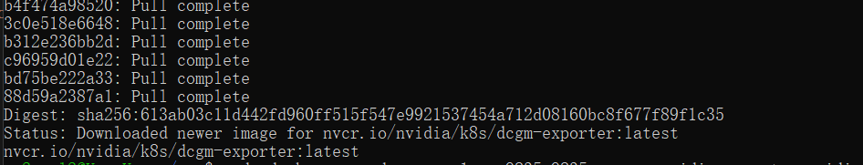

**问题：容器启动后，执行 curl http://localhost:9835/metrics 无数据返回。**

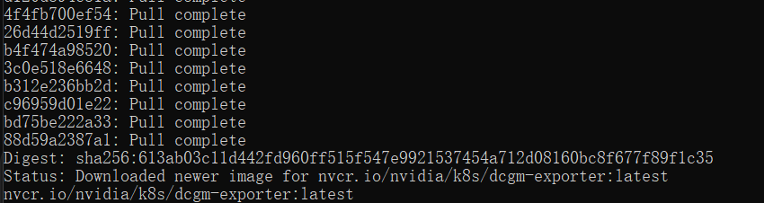
查看容器日志：
```bash
sudo docker logs nvidia-exporter
```
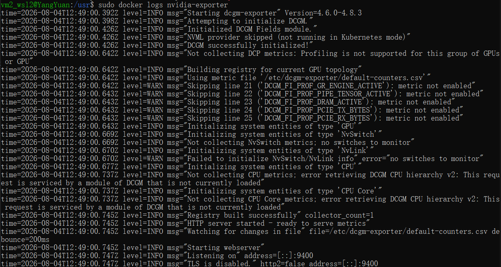
发现DCGM Exporter实际监听的是9400端口，而不是9835。查了NVIDIA官方文档，确认DCGM Exporter的默认端口就是9400。

修正
```bash
# 删除错误映射的容器
sudo docker rm -f nvidia-exporter

# 重新运行，将容器内部的 9400 映射到宿主机的 9835
sudo docker run -d --gpus all -p 9835:9400 --name nvidia-exporter nvcr.io/nvidia/k8s/dcgm-exporter:latest
```
结果验证：curl http://localhost:9835/metrics
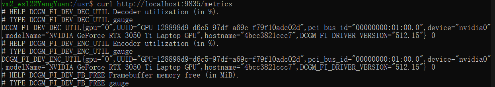
成功返回 GPU 指标数据（温度、显存、利用率等）


#### 3.4.5 排障记录5：Prometheus 采集配置与 Grafana 数据源

访问Grafana,Explore看板已经有数据了：

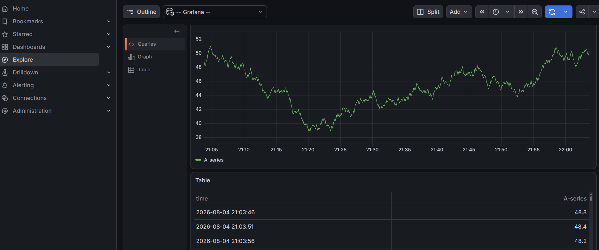

但仔细一看，这个数据是 `random` 指标，不是GPU指标。按AI的建议去找 data source配置，摸索了一下，找到了Grafana的数据源配置入口：
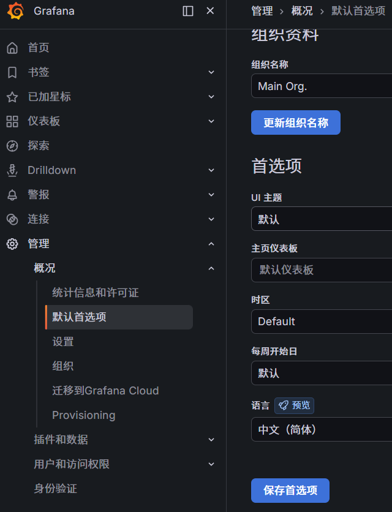

进了build a dashboard新建一个panel再点击refresh就有数据了，暂时不知道代表什么，后续实际用时再看看具体含义，大概率是metrics里的那些信息的解读，等装完大模型根据指标对应查找看看
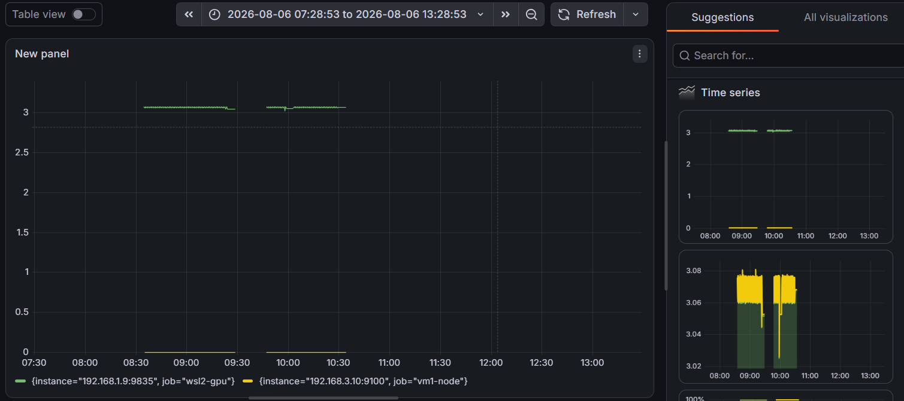
也不对，我填了DCGM_FI_DEV_GPU_TEMP想试试结果都是no data


检查采集状态：
物理机浏览器访问http://192.168.3.10:9090/targets
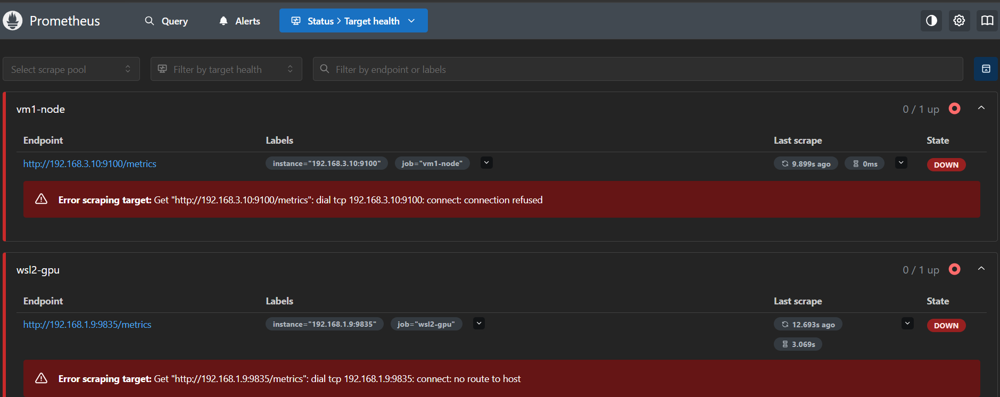
发现是网络地址错了，换wifi导致地址不对，改prometheus的配置文件的地址+docker重启动，顺便改下linux地址,增加物理机转发端口规则

修改vm1上的 ~/monitoring/prometheus.yml，添加WSL2 GPU指标的采集 job：

```yaml
scrape_configs:
  - job_name: 'prometheus'
    static_configs:
      - targets: ['localhost:9090']

  - job_name: 'wsl2-gpu'
    static_configs:
      - targets: ['192.168.3.8:9835']
```

重启 Prometheus 使配置生效：
```bash
cd ~/monitoring
docker compose restart prometheus
```

修正：
更新prometheus.yml 中的 IP 地址为当前物理机地址
重启Prometheus
确认targets 状态变为 UP

grafana中填入地址http://192.168.3.10:9090点击save通过了

**结果验证**
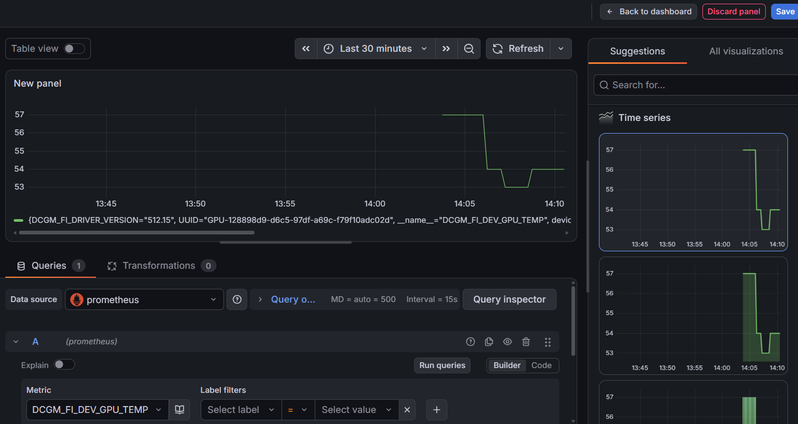
在Grafana Explore中查询DCGM_FI_DEV_GPU_TEMP，成功返回温度数据。


GPU 可观测性链路完全打通：
WSL2 上的 DCGM Exporter 采集 GPU 指标（9400）
Windows 宿主机端口转发（9400→9835）
vm1 上的 Prometheus 拉取物理机 9835 端口的指标
Grafana 展示监控数据

**网络连接的备用方案**
> **延伸排查：rp_filter 反向路径过滤**
> 在排查过程中还遇到一种情况：vm1 能 ping 通物理机但无法访问 WSL2 的转发端口。查资料后尝试关闭 Linux 的反向路径过滤（rp_filter）：
```bash
# 关闭所有网卡的反向路径过滤
sudo sysctl -w net.ipv4.conf.all.rp_filter=0
sudo sysctl -w net.ipv4.conf.eth0.rp_filter=0
# 允许转发
sudo sysctl -w net.ipv4.ip_forward=1
```
这一般不是首选方案，但在某些网络配置下（多网卡、VPN等）可以解决跨网段访问问题。我记录在此以备后续参考。


>**附：安装过程中附带了解的知识**——NvSwitch查了说是高速交换芯片，可以绕过PCIE总线和CPU，用于两张GPU高速高带宽点对点互相通信，服务器主板和专门主板才有。
多块GPU可以组成的DGX阵列，所有GPU通过NVLink线缆连接到NvSwitch芯片上。

---

### 3.5 备份

在装Ollama前先备份保险，后面还要这备份干别的，在物理机命令行输入
```bash
wsl --shutdown
#查看ubuntu的名字，等会要备份打包
wsl -l -v
#导出备份到D盘留着
wsl --export Ubuntu D:\wsl-backup-ollama-before.tar
```
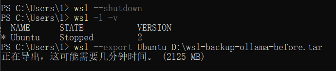

## 四、总结与下一步计划

### 4.1 经验提炼

这次部署不仅是把环境跑通，更重要的是把每一步的踩坑过程记录下来，形成可复用的排障经验。

**经验一：国内环境下的软件源配置策略**

Docker官方源和NVIDIA源都需要额外配置才能在国内正常使用。其中GPG密钥的处理方式值得注意：
- Docker源添加后需要检查密钥文件权限（`chmod a+r`），否则`apt update`会报`NO_PUBKEY`错误
- NVIDIA源的GPG密钥下载可能被墙，需要手动在浏览器中下载后导入
- 镜像拉取超时时，多次重试往往能续传完成，而非一次失败就放弃

**经验二：笔记本实验环境的网络变动管理**

WIFI切换导致IP变化是家常便饭，需要在架构设计阶段就考虑到这一点。
- 本次通过手动更新 `prometheus.yml` 中的target地址解决
- 后续可考虑用主机名解析或脚本自动更新配置

**经验三：WSL2 与虚拟机跨网络通信**

WSL2的NAT网络隔离决定了它必须通过宿主机端口转发才能被外部访问：
- `netsh portproxy` 端口转发+Windows防火墙放行是标准解法
- `rp_filter`（反向路径过滤）作为备用方案，在特定网络配置下有效

### 4.2 下一步计划

接下来在WSL2上用Ollama部署：
- `deepseek-r1:1.5b`（首选）
- `qwen2.5:3b`（如 4G 显存无法承载则换 `qwen2.5:1.5b`）

在推理负载下验证 GPU 监控指标变化，截图对比空闲态和推理态的差异。然后开发 Python 压测脚本，进行梯度压测，找到4G显存下的性能拐点。

预计1周内完成，届时输出第二篇实验记录。