# 部署ollama、大模型和压测

## 目录

- [一、环境概览](#一环境概览)
- [二、架构设计](#二架构设计)
- [三、Ollama 推理服务部署（Docker 版）](#三ollama-推理服务部署docker-版)
  - [3.1 部署命令](#31-部署命令)
  - [3.2 排障记录1：驱动版本不匹配](#32-排障记录1驱动版本不匹配)
- [四、Python 压力测试](#四python-压力测试)
  - [4.1 压测目标与指标](#41-压测目标与指标)
    - [4.1.1 总体目标](#411-总体目标)
    - [4.1.2 三个子目标](#412-三个子目标)
    - [4.1.3 硬件观测指标（GPU）](#413-硬件观测指标gpu)
    - [4.1.4 软件（业务）观测指标](#414-软件业务观测指标)
    - [4.1.5 参数梳理](#415-参数梳理)
  - [4.2 压测程序设计](#42-压测程序设计)
    - [4.2.1 程序架构](#421-程序架构)
    - [4.2.2 单点极限测试——显存和上下文极限](#422-单点极限测试显存和上下文极限)
      - [4.2.2.1 排障记录2：文本长度与 Token 数的对应关系](#4221-排障记录2文本长度与-token-数的对应关系)
      - [4.2.2.2 排障记录3：Ollama 的显存预分配机制](#4222-排障记录3ollama-的显存预分配机制)
    - [4.2.3 单点极限测试——并发](#423-单点极限测试并发)
    - [4.2.4 综合测试——正交扫描](#424-综合测试正交扫描)
    - [4.2.5 综合测试——长稳测试](#425-综合测试长稳测试)
- [五、vLLM 推理引擎部署与对比实验](#五vllm-推理引擎部署与对比实验)
  - [5.1 前置要求](#51-前置要求)
  - [5.2 部署过程](#52-部署过程)

## 一、环境概览

> 本实验的硬件环境和网络拓扑与《部署与监控接入记录》完全一致，以下仅列出关键信息，详细配置请参考该文第一节。

| 项目 | 配置 |
|------|------|
| 物理机 | 笔记本，i5-12700H，16GB DDR4，RTX 3050Ti 4GB，Windows 11 |
| 监控节点（vm1） | VMware虚拟机，Ubuntu 22.04，4GB内存，IP: 192.168.3.10 |
| 推理节点（vm2） | WSL2 Ubuntu 22.04，GPU直通，4GB显存，IP: 172.31.34.84 |
| 物理机IP | 192.168.3.8（用于端口转发） |

> **驱动与CUDA版本（本次实验关键前置条件）**：
>
> | 组件 | 初始版本 | 升级后版本 | 说明 |
> |------|----------|------------|------|
> | NVIDIA 驱动 | 512.15 | 560.81 | Ollama要求≥551.61，vLLM要求≥535.xx |
> | CUDA | 11.6 | 12.6 | 跟随驱动升级 |
>
> 驱动版本不匹配会导致容器无法使用GPU，这是本实验遇到的第一个排障点，详见 3.2 节。

---

## 二、架构设计

### 系统架构图


> **数据流向**：
> 1. 压测脚本（物理机） → HTTP请求 → WSL2（Ollama服务，端口11434）
> 2. Ollama → GPU（模型推理） → 生成结果返回物理机
> 3. GPU指标（DCGM Exporter，端口9400） → 宿主机端口转发（9835） → Prometheus（vm1） → Grafana展示

### 框架选型说明

本次实验选用两个推理框架进行对比：

| 框架 | 定位 | 适用场景 |
|------|------|----------|
| **Ollama** | 简化本地部署，开箱即用 | 个人开发、快速验证、学习探索 |
| **vLLM** | 高并发、高吞吐推理引擎 | 企业生产环境、多用户服务 |

**为什么两个都测**：

Ollama的定位是“简单好用”，其显存管理策略偏向保守（预分配 + 自动卸载到内存），适合个人开发者快速上手。vLLM 则通过 PagedAttention 机制实现高效的显存管理，理论上在相同硬件下能支撑更高的并发。

本实验希望在4GB显存这个极限环境下，实测两者的实际表现差异——vLLM的先进算法能否在小显存场景下带来可量化的增益，还是被硬件天花板完全抵消。

> vLLM的PagedAttention机制将KV Cache分页管理，显存利用率可达90%以上，而Ollama的传统连续分配策略存在碎片问题。理论上vLLM的吞吐量可达到Ollama的数倍，但本次实验的4GB显存可能限制其发挥。

---

## 三、Ollama推理服务部署（Docker版）

> 本实验的推理节点（WSL2）已在第一篇中完成Docker安装和端口转发配置，详见该文3.4节。以下仅记录Ollama部署的关键步骤和新增排障。

### 3.1 部署命令

```bash
# 拉取 Ollama 镜像
sudo docker pull ollama/ollama:latest

# 启动容器（挂载 GPU 和模型存储卷）
sudo docker run -d --gpus=1 -v ollama:/root/.ollama -p 11434:11434 --name ollama ollama/ollama
```
> 如果镜像拉取超时，可配置国内镜像加速器（方法同第一篇 3.3.2 节）

```bash
# 进入容器拉取模型
sudo docker exec -it ollama ollama pull deepseek-r1:1.5b
```

导入完毕
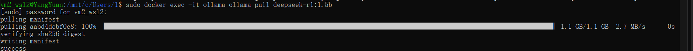
检查，拉取完成，模型已就绪
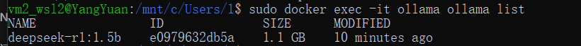
WSL虚拟机上测试
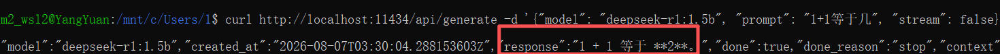

物理机上用cmd命令行测试,在cmd里面，外层的引号要换成双引号，里面原本的双引号加上反斜杠\转义
```bash
curl http://172.31.34.84:11434/api/generate -d "{\"model\": \"deepseek-r1:1.5b\", \"prompt\": \"1+1等于几\", \"stream\": false}"
```
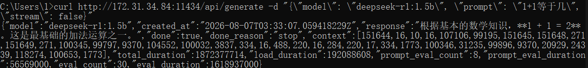

都能正常反馈，后续压测脚本就放在物理机上，主要是VMware Workstation Pro的linux server打中文比较浪费时间，这个虚拟机vm1就用来做监视脚本和环境配置的练习与试验。


### 3.2 排障记录1：驱动版本不匹配

现象：
容器启动后，ollama pull deepseek-r1:1.5b能成功下载模型，但运行推理时速度极慢，nvidia-smi显示GPU进程不存在，模型运行在CPU上。

查阅Ollama官方文档，确认Ollama的GPU支持需要NVIDIA驱动≥551.61。当前驱动为512.15，版本过低。

解决方案：

> - 升级 NVIDIA 驱动至 560.81（该版本支持 CUDA 12.6，也为后续 vLLM 实验做准备）;
> - 从 NVIDIA 官网下载对应驱动安装包;
> - 在 Windows中直接安装（WSL2 会自动同步）
> - 重启 WSL2：wsl --shutdown 后重新进入
> - 验证升级结果：nvidia-smi 显示驱动版本 560.81，CUDA 12.6(实际我装的是12.9)
> - 为什么升到 560.81 而不是最低要求 551.61？
 因为后续 vLLM 实验对驱动版本也有要求（≥535.xx），且 vLLM 的 CUDA 环境为 12.x，升级到 560.81 能同时满足两个实验的需求，避免反复升降级。


**关闭后备份wsl**

**附：其他可能用到的命令**
```bash
#查看有什么模型（最好先启动docker的ollama）
docker exec -it ollama ollama list

#查看所有（包含未运行的）容器
docker ps -a
#启动对应ID的容器
docker start <上条命令查看到的对应CONTAINER ID> 

#运行相关模型
#不过运行前面容器已经造好，运行相关容器就可以运行模型了
docker exec -it ollama ollama run <模型名称>
```


## 四、python压力测试
> 笔者之前未从事过性能测试相关工作，因此在本节实验前先梳理了压测的目标、指标和方法。

### 4.1 压测目标与指标

#### 4.1.1 总体目标

量化评估大语言模型推理服务在物理资源（RTX 3050 Ti 4GB 显存）约束下的 **极限边界** 与 **失效模式**。

#### 4.1.2 三个子目标

| 子目标 | 说明 |
|--------|------|
| **① 寻找性能拐点** | 通过阶梯式加压，摸清系统吞吐量随并发数增长的变化曲线，定位“吞吐量不再线性增长且延迟急剧飙升”的饱和拐点 |
| **② 对比调度机制差异** | 控制变量法对比 Ollama（基于 llama.cpp 的串行调度）与 vLLM（基于 PagedAttention + Continuous Batching）在高并发压力下的表现差异 |
| **③ 确立稳定性红线** | 在服务崩溃前找到安全水位，确保生产环境中即便突发流量，服务也能通过限流机制存活，而非无预警宕机 |

#### 4.1.3 硬件观测指标（GPU）
本次实验通过 Prometheus 拉取 DCGM 指标。以下为实际可用的核心字段：

| 指标名称 | 单位 | 说明 | 压测用途 |
| :--- | :--- | :--- | :--- |
| `DCGM_FI_DEV_GPU_UTIL` | % | GPU 核心利用率 | 判断计算单元是否饱和 |
| `DCGM_FI_DEV_FB_USED` | MiB | 显存已使用量 | 评估 OOM 风险 |
| `DCGM_FI_DEV_FB_FREE` | MiB | 显存空闲量 | 辅助计算剩余空间 |
| `DCGM_FI_DEV_GPU_TEMP` | ℃ | GPU 核心温度 | 监测热状态 |
| `DCGM_FI_DEV_POWER_USAGE` | W | 实时功耗 | 确认 GPU 实际工作状态 |
| `DCGM_FI_DEV_SM_CLOCK` | MHz | SM 核心时钟频率 | 监测是否发生降频 |
| `DCGM_FI_DEV_MEM_CLOCK` | MHz | 显存时钟频率 | 监测显存运行状态 |

**指标与子目标的对应关系**：

| 子目标 | 核心 GPU 指标 | 判断逻辑 |
|--------|--------------|----------|
| 寻找性能拐点 | `GPU_UTIL` | 吞吐停滞但 GPU_UTIL < 80%，说明瓶颈不在计算核心 |
| 对比调度机制 | `FB_USED`、`POWER_USAGE` | 不同框架的显存时序变化模式差异，功耗确认活跃状态 |
| 确立稳定性红线 | `FB_USED`、`TEMP`、`SM_CLOCK` | FB_USED 衡量距 OOM 的距离，TEMP+SM_CLOCK 联合判断是否热降频 |


#### 4.1.4 软件（业务）观测指标
| 子目标 | 核心指标 | 业务含义 |
|--------|----------|----------|
| 寻找性能拐点 | **QPS**、**平均响应延迟** | QPS 反映系统吞吐，延迟反映用户体验。拐点即“吞吐不增、延迟飙升”的临界并发数 |
| 对比调度机制 | **TTFT**、**TPOT**、**QPS** | TTFT 反映 Prefill 效率，TPOT 反映 Decode 效率，三者拆解框架在各阶段的差异 |
| 确立稳定性红线 | **错误率**、**崩溃恢复时间**、**输出完整性** | 错误率突增通常与 OOM 正相关，输出完整性检测“静默截断” |

**指标定义与计算方式**：

| 指标 | 缩写 | 计算方式 | 采集时机 |
| :--- | :--- | :--- | :--- |
| 每秒查询数 | QPS | 总成功请求数 / 总耗时（秒） | 离线计算 |
| 平均响应延迟 | Avg Latency | Σ(响应完成时间 - 发送时间) / 总请求数 | 离线计算 |
| 首 Token 延迟 | TTFT | t_first_byte - t_send | 每条请求实时记录 |
| 每 Token 生成时间 | TPOT | (t_last_byte - t_first_byte) / token_count | 每条请求实时记录 |
| 错误率 | Error Rate | 失败请求数 / 总请求数 | 离线计算 |
| 崩溃恢复时间 | Recovery Time | 首次检测拒绝 → 再次收到成功响应的时间差 | 脚本实时计时 |
| 输出完整性 | Output Integrity | 实际 Token 数 / 期望 Token 数 × 100% | 每条请求实时记录 |

#### 4.1.5 参数梳理

在编写压测程序之前，先明确两个问题：

**输入参数：我们能调整什么？**

从Ollama API出发：

这是整理的需要的以及排除的参数。
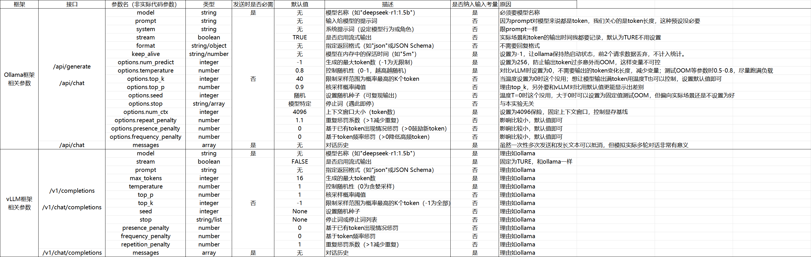

| 参数 | 处理方式 | 说明 |
|------|----------|------|
| `model` | 固定 | deepseek-r1:1.5b |
| `prompt` | 变化 | 控制输入长度 |
| `num_predict` | 变化 | 控制输出长度 |
| `num_ctx` | 变化 | 控制上下文窗口，**核心变量** |
| `temperature` | 固定为 0 | 排除随机性干扰 |
| `stream` | 固定为 false | 简化结果采集 |
| `keep_alive` | 固定为 -1 | 模型常驻显存 |


**输入token有意义的参数**
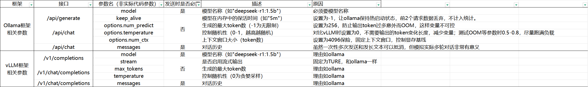

**软件应用层输出结果指标**
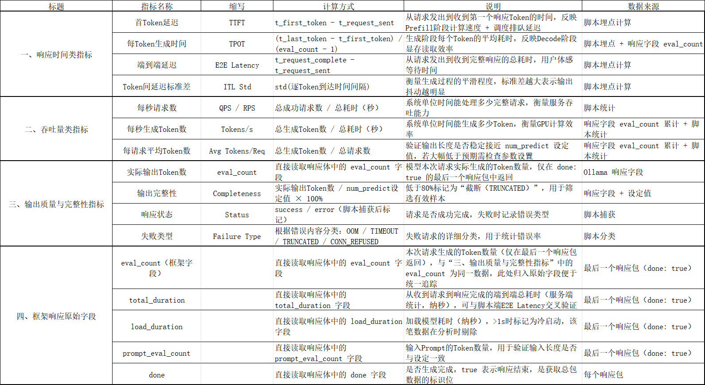

**硬件层指标**
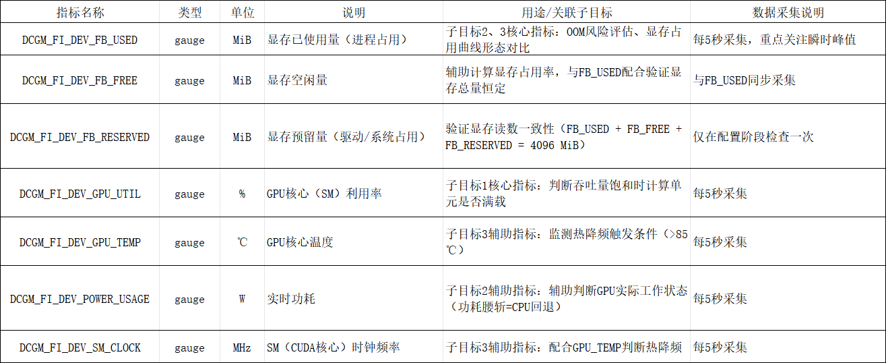


**输出结果：我们记录什么？**

| 类别 | 指标 | 来源 |
|------|------|------|
| 软件层 | RPS、P99 延迟、TTFT、TPOT、错误率 | 压测脚本记录 |
| 硬件层 | GPU_UTIL、FB_USED、温度、功耗、频率 | Prometheus / DCGM |


> **两类指标的关系**：硬件指标和软件指标在分析时需按时间轴合并，形成完整的观测链条。例如，P99 延迟飙升时，对应的 GPU_UTIL 是否已饱和、FB_USED 是否已接近上限——两者结合才能定位真正的瓶颈。


### 4.2 压测程序设计
从三个子目标看，我们要实现的是：
> - “阶梯式加压”找到性能拐点
> - 确立稳定性红线,在OOM前限流和保证模型服务存活，所以就要找到OOM的触发预警条件
> - ollama和vLLM对比推理架构性能


**数据流向**
物理机———发送请求—→虚拟机vm2_wsl2大模型
虚拟机vm2_wsl2大模型———返回数据—→物理机
虚拟机vm2_wsl2大模型———被抓取数据—→虚拟机vm1_ubuntu的Prometheus——→grafanna显示GPU数据

**测试方向**
先找单点极限，如上下文、并发数量对GPU的影响，怎样会达到GPU瓶颈和OOM，以及返回结果的速度指标如何
再找综合极限，将上下文和并发数量结合起来，看GPU在什么程度能保持高负载和高处理速度，将KV cahe和核心计算性能用满
最后再和vLLM对比

**测试流程——四阶段**
|阶段|名称|做什么？|关键参数|
|----|----|----|----|
|一|单点极限：显存探测|并发固定为 1，从短 Prompt 开始，逐渐加长，直到模块B报失败。记录最后一个成功长度。|并发=1，长度步进来自 config.yaml 的 oom_prompt_lengths|
|二|单点极限：并发探测|固定使用 阶段一极限的 50% 作为安全长度，从 1 个并发开始逐渐增加，直到吞吐量（RPS）不再线性增长。记录饱和时的并发数。|长度固定，并发步进 1→2→4→8→16→24→32→48|
|三 |综合测试：正交扫描|在“安全范围”内取点（极限的 30%、50%、70%、100%），组合成网格（3个长度 × 4个并发 = 12个点），逐个测试，收集每个点的 RPS 和 P99 延迟。|网格采样，不穷举|
|四|综合测试：长稳测试|从阶段三中选出 “成功率 100% 且 RPS 最高” 的那个组合，固定下来，持续灌流跑 30 分钟，检查是否中途崩溃或延迟抖动过大。|满载运行（轮次间隔=0秒），时长 30 分钟|

#### 4.2.1 程序架构
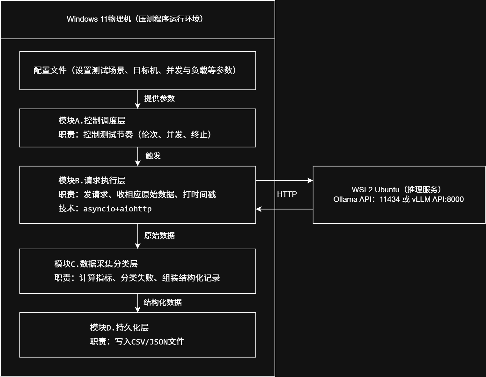

#### 4.2.2 单点极限测试——显存和上下文极限
> **目标**：获取 RTX 3050Ti 4GB 显存下，deepseek-r1:1.5b 单请求能支撑的最大上下文长度。


**重点监测指标**
>Prometheus：
GPU显存已使用量DCGM_FI_DEV_FB_USED
GPU计算核心使用率DCGM_FI_DEV_GPU_UTIL
grafana显示数据间隔5S

**config.yaml初始参数配置**
```yaml
framework: ollama
api_base_url: http://172.31.34.84:11434
api_path: /api/generate

scenario: comparison
concurrency: [1, 2, 4, 8, 16]
requests_per_round: 50
round_interval: 30
timeout: 30

prompt_length: 1024
num_predict: 256
temperature: 0
num_ctx: 16000
repeat_penalty: 1.0

stream: false
keep_alive: -1

output_dir: ./output
write_per_round: true

oom_prompt_lengths: [256, 512, 1024, 2048, 4096, 8192, 16000, 32000, 64000, 128000, 256000]
oom_temperature: 0.7

stage1_interval_seconds: 20
```
> - stage1_interval_seconds: 20表示每次请求之间间隔20秒，用于给监控系统留出采集窗口


**ollama提供的模型数值**
其中ollama软件上下文上限是131072token，我实际物理机上限还需测试
```bash
docker exec -it ollama ollama show deepseek-r1:1.5b
```
> - Model
    architecture        qwen2
    parameters          1.8B
    context length      131072
    embedding length    1536
    quantization        Q4_K_M
> -  Capabilities
    tools
    thinking
    completion
> -  Parameters
    stop    "<｜begin▁of▁sentence｜>"
    stop    "<｜end▁of▁sentence｜>"
    stop    "<｜User｜>"
    stop    "<｜Assistant｜>"
> -  License
    MIT License
    Copyright (c) 2023 DeepSeek
    ...

注：其中oom_prompt_lengths是发送的文本长度（无意义文本，因为本次实验不关注回复质量），经过测试长度=64000 字符, 真实Token数=8003。所以对应范围设置初步为[256, 512, 1024, 2048, 4096, 8192, 16000, 32000, 64000, 128000, 256000]

##### 4.2.2.1排障记录2：文本长度与 Token 数的对应关系

运行结果
```
[阶段一] 开始探测显存极限（单请求，逐步加压）
[调试] 长度=256 字符, 真实Token数=145
[调试] 长度=512 字符, 真实Token数=286
[调试] 长度=1024 字符, 真实Token数=570
[调试] 长度=2048 字符, 真实Token数=1138
[调试] 长度=4096 字符, 真实Token数=2275
[调试] 长度=8192 字符, 真实Token数=4550
[调试] 长度=16000 字符, 真实Token数=8885
[调试] 长度=32000 字符, 真实Token数=8003   ← 异常
[调试] 长度=64000 字符, 真实Token数=8003   ← 异常
[调试] 长度=128000 字符, 真实Token数=8003  ← 异常

```
**运行时间逐渐增加是正常的，不过为什么16000长度后突然时间变短了，真实token数也变成8003，增加文本质量（可能重复率太高被压缩了）和在程序中检测实际文本长度,后续已修正生成逻辑**

在wsl用docker logs -f ollama看ollama日志最后的请求部分
```bash
docker logs -f ollama
#以下是记录
time=2026-08-09T08:55:39.840Z level=WARN source=llama_server.go:314 msg="truncating input prompt" limit=8003 prompt=143720 keep=5 new=8003
```

被ollama截断了，说明config的设置没生效

```bash
docker run -d --gpus all -p 11434:11434 -e OLLAMA_MAX_PROMPT_SIZE=32000  -v ollama:/root/.ollama  --name ollama ollama/ollama
```

检查后环境变量是对的，但是还是8003

**根因**：当 num_ctx=16000 时，Ollama 的发送限制约为 num_ctx/2 = 8000，超过部分的 Token 被截断。

修改config.yaml的num_ctx: 32000（原来是16000）发现就能突破8003了，原来发送限制=num_ctx/2，应该是ollama怕模型生成对应长度文本导致空间不够用而预留的！

#### 4.2.2.2 排障记录3：Ollama 的显存预分配机制

现象：继续提升 num_ctx 后，发现显存占用并不随输入文本长度变化，而是在服务启动时就固定了。

grafana还是改成2秒显示间隔比较好，计算耗时基本都是2秒以上

尝试方法
```bash 
docker run -d --gpus all  --restart unless-stopped -p 9835:9400 -e DCGM_EXPORTER_INTERVAL=2000 --name nvidia-exporter nvcr.io/nvidia/k8s/dcgm-exporter:latest
```
prometheus设置后重启
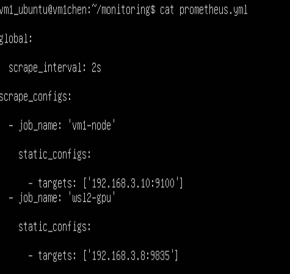

grafana的设置,删掉旧容器换个新的，设定最小可以2秒一次刷新
```bash
docker run -d -p 3000:3000  --name grafana  -e GF_DASHBOARDS_MIN_REFRESH_INTERVAL=2s   grafana/grafana:latest
```


现在运行测试程序,运行结果如下（删掉部分无意义的），发现奇怪的地方
```
[阶段一] 开始探测显存极限（单请求，逐步加压）
[时间戳] 请求结束: 2026-08-09 20:41:33 (耗时: 8327 ms)
[调试] 长度=256 字符, 真实Token数=137

[时间戳] 请求结束: 2026-08-09 20:41:46 (耗时: 7710 ms)
[调试] 长度=512 字符, 真实Token数=291

[时间戳] 请求结束: 2026-08-09 20:41:58 (耗时: 7721 ms)
[调试] 长度=1024 字符, 真实Token数=568

[时间戳] 请求结束: 2026-08-09 20:42:12 (耗时: 8248 ms)
[调试] 长度=2048 字符, 真实Token数=1147

[时间戳] 请求结束: 2026-08-09 20:42:26 (耗时: 9098 ms)
[调试] 长度=4096 字符, 真实Token数=2301

[时间戳] 请求结束: 2026-08-09 20:42:42 (耗时: 11110 ms)
[调试] 长度=8192 字符, 真实Token数=4593

[时间戳] 请求结束: 2026-08-09 20:43:02 (耗时: 15137 ms)
[调试] 长度=16000 字符, 真实Token数=8976

[时间戳] 请求结束: 2026-08-09 20:43:33 (耗时: 25568 ms)。
[调试] 长度=32000 字符, 真实Token数=17959

[时间戳] 请求结束: 2026-08-09 20:44:43 (耗时: 65206 ms)
[调试] 长度=64000 字符, 真实Token数=35930

[时间戳] 请求结束: 2026-08-09 20:45:51 (耗时: 62702 ms)
[调试] 长度=72000 字符, 真实Token数=40425

[时间戳] 请求结束: 2026-08-09 20:47:08 (耗时: 72827 ms)
[调试] 长度=80000 字符, 真实Token数=44920

[时间戳] 请求结束: 2026-08-09 20:48:56 (耗时: 102547 ms)
[调试] 长度=96000 字符, 真实Token数=53888

[时间戳] 请求结束: 2026-08-09 20:51:01 (耗时: 120023 ms)
[阶段一] 长度 112000 失败，原因: TIMEOUT...
[模块A] 触发熔断保护！长度=112000, 并发=1
[模块A] 警告：推理服务不可用，进入等待恢复模式...
[模块A] 恢复尝试 1/5，等待 60 秒...
```
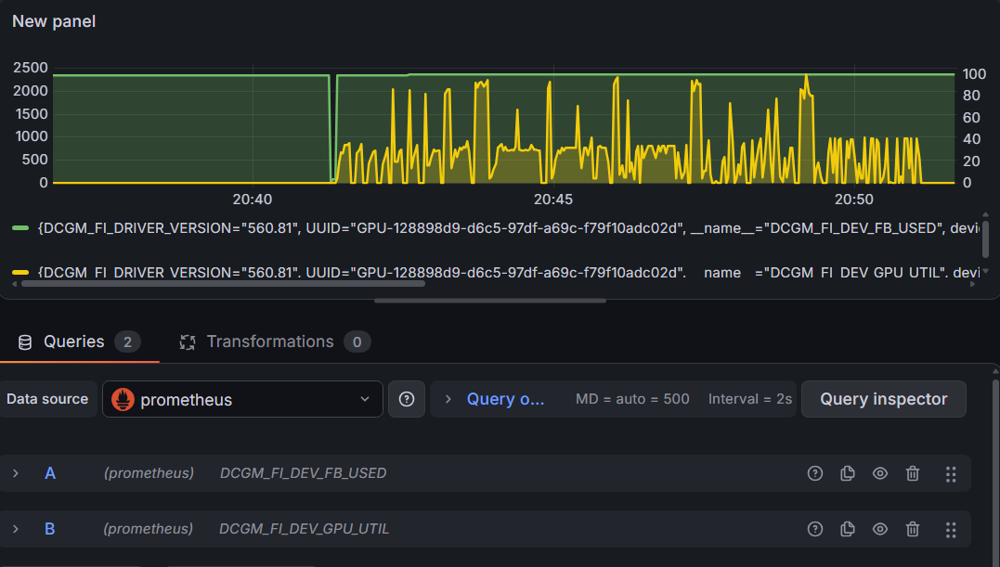

最后是计算超过我限定的时间才触发熔断机制，实际可以继续计算。

> - GPU核心:
现象：前面规律是激增再快速到达其顶峰一半水平（除去开始的低负载情况），最后却只在10-50来回跳动。
占用率开始时都会激增，然后跳水到一半左右，但最后计算112000的时候就长期在50和10之间来回跳动，直到超时。就如图中每个高峰都是明显高峰都是计算开始的标志，一个跌入最低部是我设计的5秒缓冲用于识别开始和结束。

> - GPU显存：
现象：除了开始冷加载模型外从0到2330之外基本没有变化，变化从2330到最后2360，没有下降趋势，但增幅不明显。
按理说长的上下文会让显存激增，可是变化很小，可能是这个上下文内容还是太少，原因是显存是在增加没有下降的，个别增加的时候正好是GPU尖峰位置，毕竟一个大模型只能输入几万token的话就太少了，只是我电脑带不动。

> - CPU（我特意打开任务管理器关注）:
现象：在任务开始且GPU计算的时候居然从20激增到60-80以上。
个人以为大模型都看GPU，没想到CPU也会参与，接下来要研究为什么CPU会参与，跟大模型和GPU有什么关联，要去了解发送token给ollama之后会各硬件是怎么联动的。

> - 内存：基本无变化，预期之中。
可惜内存条太小，现在想附带监控CPU再开软件就内存爆了，只能开任务管理器。

**这些现象的可能原因**
我去询问AI大模型在硬件中执行的流程
| 环节 | 数据量级 | 耗时占比 | 硬件执行的任务 | 硬件瓶颈 |
| :--- | :--- | :--- | :--- | :--- |
| CPU分词/解码 | KB ~ MB 级 | < 1% | 将输入文本切分为Token ID，或最终将Token ID解码为输出文字 | 单核频率（i7-12700H 足够） |
| PCIe传输（CPU ↔ GPU） | KB 级（输入/输出） | < 0.5% | 在系统内存和显存之间搬运Token ID及计算结果 | PCIe带宽（远未饱和） |
| 显存（VRAM）→ L2缓存搬运 | GB 级（1.1G权重 + KV缓存） | 约 92% | 将模型权重和上下文缓存（KV Cache）从显存分块读取到L2缓存 | 显存带宽（160 GB/s 过于狭窄） |
| L2缓存 → L1缓存/寄存器搬运 | MB 级 | 约 4% | 将L2中的小块数据继续切分并分发到各计算单元私有的L1和寄存器 | 芯片内部总线（速度极快） |
| CUDA/张量核心计算 | KB 级 | 约 3% | 执行矩阵乘加运算，生成新的分数（Logits）和更新KV缓存 | 算力严重过剩（非瓶颈） |
| 显存连续大块分配 | 申请数GB连续空间 | 可能挂起 | 在显存中为长文本KV缓存分配连续内存区域 | 4GB显存过小 + Windows驱动碎片化导致分配失败 |

> - ①所以CPU目前还算正常
CPU在处理分词和虚拟机的调度，CPU占用率会增长是正常，只是增加速度和幅度大，就是激增然后猛降（我温度还是在正常范围，应该不会触发限制）。
> - ②GPU核心算正常
GPU开始激增是开始的搬运数据够多计算量大，后面降低应该是数据搬运速度不够导致计算核心性能发挥不够，搬一点算一点，导致起起伏伏，我采集间隔2秒还是不够。
> - ③GPU显存不符合预期，可能是我config.yaml做的限制导致初始分配的显存空间固定了
（待验证）AI说KV Cache 大小 = num_ctx × 层数 × 注意力头数 × 每个缓存单元字节数
（待验证）keep_alive: -1，让模型留在显存中，处理完隔5秒就发送更长的文本，直到OOM，可是一直没增加，难道是只根据第一个文本决定分配的空间？


**很有可能是num_ctx：最大Token窗口直接让ollama分配好固定的显存空间，导致显存一直维持2300-2400**
前面128000，开始时小段时间2329→稳定2351
num_ctx换成156000，开始时小段时间2369→稳定2391

起点增加40，同样的几段文本长度运行全程涨幅都是20
说明更改num_ctx有效，不过很小，换算一下每增加700num_ctx=1显存Mib

**改后发现内存运行时增加2G，专用GPU内存还是2.3G+共享gpu内存显示0.3G=GPU内存2.6G，肯定有什么软限制导致要转移到内存**

```bash
#删除旧容器换调试模式
docker run -d --gpus all -p 11434:11434 -e OLLAMA_MAX_PROMPT_SIZE=32000 -e OLLAMA_DEBUG=1 -v ollama:/root/.ollama --name ollama ollama/ollama
#查看日志
docker logs -f ollama
```
```text
common_params_fit_impl: projected to use 4708 MiB of device memory vs. 3289 MiB of free device memory
common_params_fit_impl: cannot meet free memory target of 1024 MiB, need to reduce device memory by 2442 MiB
common_params_fit_impl: context size set by user to 131072 -> no change
common_params_fit_impl: id=0, target=2265 MiB

#如果按num_ctx=131072 全量分配，需要 4708 MiB 显存,留了 1024 MiB 的安全余量，所以实际可用只有 3289 - 1024 = 2265 MiB,把显存目标压缩到 2265 MiB，超出的部分（4708 - 2265 = 2443 MiB）全部丢给系统内存（RAM）
llama_kv_cache:        CPU KV buffer size =  2176.00 MiB
llama_kv_cache:      CUDA0 KV buffer size =  1408.00 MiB

#28 层模型中，只有 12 层在 GPU 上，剩余 16 层在 CPU 内存中运行
common_params_fit_impl: id=0, n_layer=12, n_part=0, overflow_type=4, mem=2224 MiB
load_tensors: offloading 11 repeating layers to GPU
load_tensors: offloaded 12/29 layers to GPU
load_tensors:   CPU_Mapped model buffer size =   576.61 MiB
load_tensors:        CUDA0 model buffer size =   483.27 MiB
```

**关键发现：**
**预分配机制**：Ollama在启动时根据num_ctx预先分配KV Cache显存，而非按实际输入长度动态分配。显存占用在服务启动时即已确定，不随单次请求的文本长度变化。

**自动层卸载**：4GB显存下，Ollama 为保留1024MiB安全余量，将28层模型中的 16 层卸载到系统内存（CPU），仅12层留在GPU上运行。这解释了为什么显存占用被压在2.3GB附近。


**解决方案**：
num_gpu: 999让层数都尽量集中在GPU上，数字越小越会放到内存让CPU算，0就是全部让CPU和内存处理

```bash
# 强制将所有层保留在 GPU 上
docker run -d --gpus all -p 11434:11434 \
  -e OLLAMA_MAX_PROMPT_SIZE=32000 \
  -e OLLAMA_DEBUG=1 \
  -v ollama:/root/.ollama \
  --name ollama ollama/ollama

```
在 config.yaml中增加参数：
```yaml
num_gpu: 999   # 让层数都尽量集中在 GPU 上 
```

最终结论

| num_ctx | 显存占用 | 状态| 
| :--- | :--- | :--- | 
|64000|~2.3 GB|正常|
|98000|~3.8 GB|极限|
|100000|>3.8 GB|不正常（内存占用增加）|

num_ctx: 98000 是 4GB 显存下的上下文极限。

测试关键的参数
```yaml
oom_prompt_lengths: [64000, 96000, 112000, 128000, 144000, 152000, 160000, 166000]
num_gpu: 999
num_ctx: 98000
```
最终结果
```
[时间戳] 请求结束: 2026-08-10 15:09:50 (耗时: 17920 ms)
[调试] 长度=64000 字符, 真实Token数=35930

[时间戳] 请求结束: 2026-08-10 15:10:18 (耗时: 17849 ms)
[调试] 长度=96000 字符, 真实Token数=53888

[时间戳] 请求结束: 2026-08-10 15:10:41 (耗时: 13403 ms)
[调试] 长度=112000 字符, 真实Token数=62866

[时间戳] 请求结束: 2026-08-10 15:11:06 (耗时: 14777 ms)
[调试] 长度=128000 字符, 真实Token数=71851

[时间戳] 请求结束: 2026-08-10 15:11:32 (耗时: 16199 ms)
[调试] 长度=144000 字符, 真实Token数=80838

[时间戳] 请求结束: 2026-08-10 15:11:54 (耗时: 11858 ms)
[调试] 长度=152000 字符, 真实Token数=85330

[时间戳] 请求结束: 2026-08-10 15:12:17 (耗时: 12259 ms)
[调试] 长度=160000 字符, 真实Token数=89825

[时间戳] 请求结束: 2026-08-10 15:12:38 (耗时: 11284 ms)
[调试] 长度=166000 字符, 真实Token数=93188
[阶段一] 所有预设长度均通过，显存极限取最大值: 166000

```
注：输出文本长度（字符数）与 Token 数的转换比例约为 1.7，即 1 Token ≈ 1.7 个中文字符。


实际图像，可以看到GPU显存和占用基本满的，波形不再像之前的连续尖峰不平稳，长文本结束时基本只在最后有下降
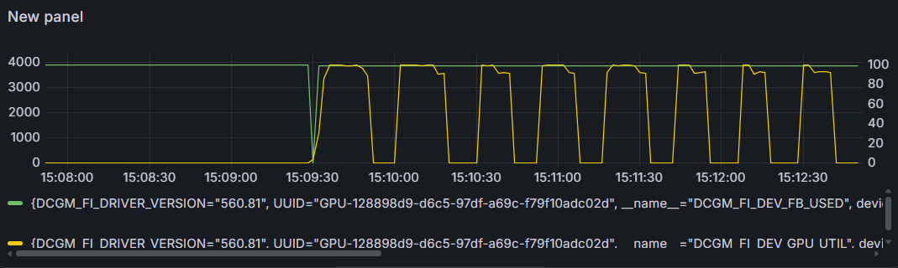

**疑点——后期长文本计算时间比中间测试中文本快**
我看了温度都在70左右，没到限制
运行几次也是这样，说明不是偶然

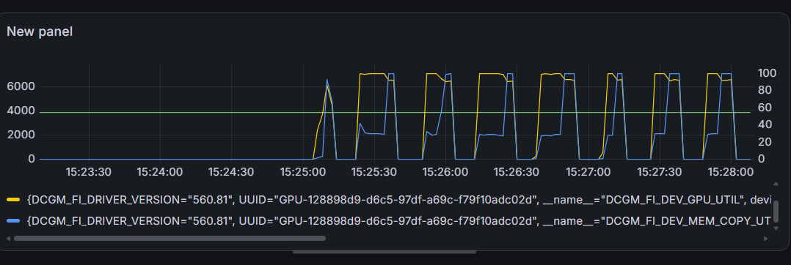
新增指标DCGM_FI_DEV_MEM_COPY_UTIL（GPU内部DMA数据搬运引擎占用率百分比），负责PCIe 传输和内部拷贝
所以极有可能就是强制使用的内存0.2G传输导致的，现在调低上下文长度，降低显存使用看看
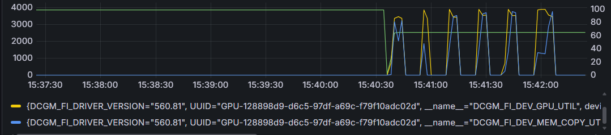

现在降低一半，还是强制使用了内存0.2G，计算量
计算时间是一直增长的（为什么十几万字时候反而最后变快了？）
这个指标在单个文本计算最后猛增，是不是内存存的0.2G数据最后传过来给GPU计算？还是GPU最后一次性将生成文本编码传过去导致的？可分到内存CPU应该也会计算，不用给GPU了
但是最后GPU的结果一定很小，不至于高占用
可能时某种缓存，CPU计算时从5到14%，说明可能有某种计算，但现在找不到是什么，可能是ollama导致的。
虽然这个现象暂时没有完全解释清楚，但不影响本次实验的核心目标——显存极限已经确定。这个疑点留待后续结合 vLLM 对比实验进一步分析。


**理论验算**    

```
模型参数：
- 层数（n_layer）：28
- KV 头数（n_head_kv）：2
- 单头维度（head_dim）：128
- 精度：f16（2 字节）

每 Token 的 KV Cache 大小：
= 2（K和V）× 28（层数）× 2（KV头数）× 128（维度）× 2（字节）
= 28672 字节 = 28.0 KiB

总显存占用 = 模型权重（1059.88 MiB）+ KV Cache + 其他开销

98000 Token 的 KV Cache = 98000 × 0.02734375 ≈ 2679.69 MiB（≈ 2.62 GB）
总显存占用 ≈ 1059.88 + 2679.69 + 100 ≈ 3839.57 MiB

反推验证：3891.2 - 1059.88 - 150 = 2681.32 MiB
2681.32 / 0.02734375 ≈ 98058 Token
```
实测与理论计算结果吻合，验证了 num_ctx=98000 的准确性


### 4.2.3 单点极限测试——并发
目标：找到吞吐饱和点和延迟拐点

**需观测的GPU参数（来自DCGM Exporter / Grafana）**

| 指标名称 | 单位 | 含义 | 并发测试中的意义 |
| :--- | :--- | :--- | :--- |
| `DCGM_FI_DEV_GPU_UTIL` | % | GPU 核心利用率（SM占用率） | 越高越好，持续 >95% 说明计算核心是瓶颈 |
| `DCGM_FI_DEV_MEM_COPY_UTIL` | % | 显存带宽利用率（DMA引擎） | 高值表示数据搬运（PCIe/内部拷贝）成为瓶颈 |
| `DCGM_FI_DEV_FB_USED` | MiB | 显存已用量（帧缓存占用） | 随并发增加略有上升，但不会线性增长（KV Cache共享） |
| `DCGM_FI_DEV_POWER_USAGE` | W | GPU 实时功耗 | 接近TDP（如60W中用到55W+）说明GPU满负载运行 |
| `DCGM_FI_DEV_SM_CLOCK` | MHz | 流处理器频率 | 降频说明温度或功耗墙触发，性能下降 |


**需计算的性能指标（从模块B返回的数据中提取）**

| 指标名称 | 计算公式 | 含义 |
| :--- | :--- | :--- |
| **RPS（每秒请求数）** | `成功请求数 / 总耗时（秒）` | 系统吞吐能力，越高越好 |
| **P99 延迟（毫秒）** | 所有成功请求的 `rtt_ns` 排序后取 99 分位，除以 1e6 | 反映最差 1% 请求的体验，是稳定性的关键指标 |
| **平均延迟（毫秒）** | `Σ(rtt_ns) / 成功请求数 / 1e6` | 反映普通用户的平均等待时间 |
| **生成吞吐量（Token/s）** | `Σ(eval_count) / 总耗时（秒）` | 模型实际生成 Token 的速度，反映计算效率 |


**理论拐点判定标准**

| 现象 | 判定逻辑 | 结论 |
| :--- | :--- | :--- |
| RPS 增长率 < 20% | `(当前RPS - 上一RPS) / 上一RPS < 0.2` | 计算核心（GPU SM）已饱和，增加并发不再提高吞吐 |
| P99 延迟突然跳涨（例如从 8000ms 跳至 15000ms） | 当前并发 P99 较上一并发增长 > 50% | 显存带宽或 CPU 调度成为瓶颈，请求开始排队 |
| `DCGM_FI_DEV_GPU_UTIL` 不再随并发增加而上升（已达 95%+） | GPU 利用率曲线变平 | 瓶颈不在 GPU 计算，而在显存带宽或 CPU 预处理 |
| `DCGM_FI_DEV_MEM_COPY_UTIL` 持续 > 70% | 显存带宽利用率过高 | 数据搬运成为限制因素，可能导致延迟增加 |

**综合判定**：取上述几个条件中**最早出现**的并发数作为“性能拐点”，即推荐的最大并发数。超过该值，系统吞吐不再提升，延迟急剧恶化。

**关键参数设定**
并发文本长度concurrency_test_length: 64000
num_ctx: 98000
并发数concurrency: [1, 2, 4]
每种并发有50个请求为一组

GPU核心占用率和显存占用
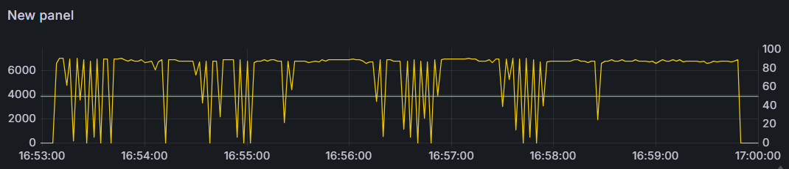
显存带宽利用率
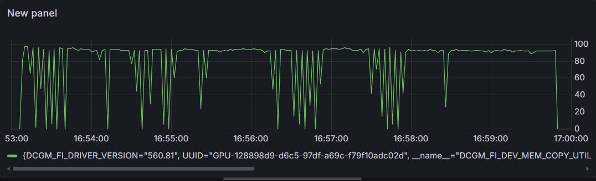
电源使用
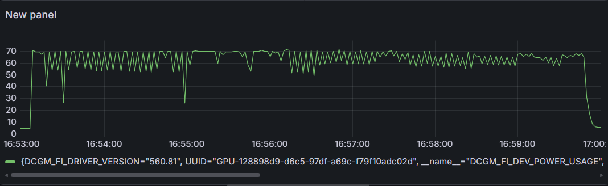
流处理器频率
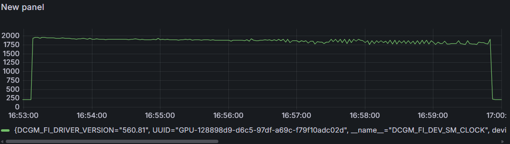

去掉电源和显存占用后的综合对比图（包含 GPU 核心利用率、显存带宽、核心频率）
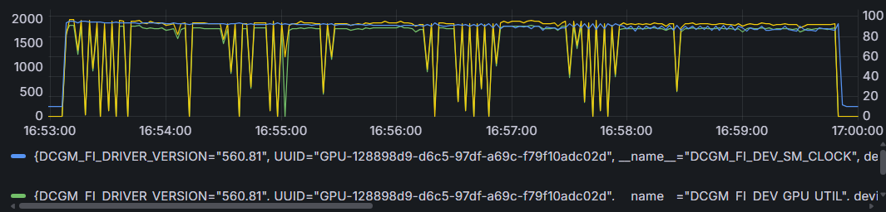

以下为 concurrency_test_length=64000 时的初始测试结果（50请求/组）：
|concurrency|	rps|	p99_ms|
|--|--|--|
|1|	0.2473|	4187.3399|
|2|	0.2536|	8070.5907|


> -显存DCGM_FI_DEV_FB_USED
是num_ctx: 98000定死的，一直都是专用3.8G+0.2G共享内存
> - 核心使用DCGM_FI_DEV_GPU_UTIL
基本都在88上不去，但是偶尔有直接到2猛降的情况，因为发送之间没间隔我看不出，代码接下来要发送加间隔
> - 带宽占用率DCGM_FI_DEV_MEM_COPY_UTIL
和DCGM_FI_DEV_GPU_UTIL曲线基本一样，但是最高能到94-96
> - 电源DCGM_FI_DEV_POWER_USAGE
电源是55-70W的锯齿状，只有一次到26.1
> - 处理器频率DCGM_FI_DEV_SM_CLOCK
前半段1850-1950比较平稳，后半段到1770-1850的锯齿状

由此可见笔记本电脑并发1已经是极限，测试途中温度也达到温度墙
接下来为了观察清晰（真实场景无间隔），并发每组临时增加3秒间隔，跑一次并发1的10个请求，将测试长度从 64000 改为更短的文本（如 1024 字符）分开测试

**每组5秒间隔，跑一次并发1的10个请求，并发1，2，4，不管拐点强行运行完**

|concurrency|	rps|	p99_ms|
|--|--|--|
|1|	0.2491|	4149.6908|
|2|	0.2544|	8188.6395|
|4|	0.2539|	16166.8088|
|8|	0.2566|	31425.0184|

rps都非常低，不过硬件负载都是满的，可以看到p99都是成倍增长。

接下来测最高能并发多少同时p99很低，rps高

** 数据汇总（取每组中并发1的RPS和P99，以及并发2/4/8的相对变化，一组48个请求）**

| `concurrency_test_length` | `num_ctx` | 并发1 RPS | 并发1 P99 (ms) | 并发2 RPS | 并发2 P99 (ms) | 并发4 RPS | 并发4 P99 (ms) | 并发8 RPS | 并发8 P99 (ms) |
| :---: | :---: | :---: | :---: | :---: | :---: | :---: | :---: | :---: | :---: |
| 16000 | 98000 | 0.370 | 2782.38 | 0.385 | 5553.52 | 0.382 | 10666.95 | 0.380 | 21402.02 |
| 8000 | 98000 | 0.386 | 2654.00 | 0.415 | 5214.39 | 0.405 | 10150.01 | 0.407 | 19991.74 |
| 4000 | 98000 | 0.412 | 2484.11 | 0.436 | 5012.54 | 0.430 | 9414.21 | 0.430 | 18938.22 |
| 2000 | 98000 | 0.430 | 2389.13 | 0.450 | 4782.79 | 0.448 | 9190.13 | 0.439 | 18667.84 |
| 1000 | 98000 | 0.433 | 2396.07 | 0.453 | 4800.94 | 0.453 | 9221.67 | 0.444 | 18245.31 |
| 500 | 98000 | 0.423 | 2457.57 | 0.452 | 4680.45 | 0.439 | 9365.14 | 0.442 | 18410.77 |
| 500 | 40000 | 0.422 | 2453.83 | 0.441 | 4923.58 | 0.441 | 9298.70 | 0.437 | 18582.04 |

输出文本长度num_predict从256修改到100，rps0.9-1.1，p99从1035到7349
输出文本长度num_predict从256修改到20，rps3.1-5.3，p99从334到1994


> - rps极限就是在0.43左右，再短的文本输入都没有实际意义，更多取决于输出长度上（我预设num_predict=256）
> - 输入长度对延迟影响有限，增加并发对吞吐量几乎无效，p99根据并发数量翻倍而翻倍增长，总延迟 = 单请求延迟 × 队列长度
> - num_ctx上下文长度对性能几乎无影响
> - 并发极限就是1，笔记本电脑性能有限
> - Prefill（预填充）和Decode（自回归生成）固定占用输出时间，同长度下无法通过调整参数减少，可以后续结合grafana曲线分析模型处理的过程


**结论**

在256Token输出长度下，单请求rps约为0.43req/s，由GPU 显存带宽（192 GB/s）与模型权重规模（1.1 GB）的物理比例决定。吞吐量主要受输出 Token长度（num_predict）影响，输入长度影响较小。本机有效并发上限为1，超过该值吞吐量不再提升且 P99 延迟呈线性倍增。

从4.2.2.2的DEBUG日志可见，Ollama在显存不足时会主动将部分KV Cache 和模型层卸载到系统内存，以此避免显存OOM导致进程崩溃。这符合其“安全部署”的设计定位。

### 4.2.4 综合测试——正交扫描

正交扫描的目标是在“安全范围”内取点（极限的30%、50%、70%、100%），组合成网格（3个长度×4个并发 =12个点），逐个测试。

实际测试后发现：**当并发 > 1 时 RPS 不再增长，P99 延迟随并发数线性倍增**。因此正交扫描未能产出新的性能拐点信息，结果已包含在4.2.3的数据汇总表中（不同 `concurrency_test_length` 对应的RPS和P99数据）。

结论：本机有效并发上限为1，正交扫描的必要性不大——硬件天花板在并发测试中已经暴露，无法通过调整输入长度来突破。

### 4.2.5 综合测试——长稳测试

在1并发下，分别以长文本（16000字符，RPS最低）和短文本（2000 字符，RPS 最高）测试10分钟稳定性。

**测试参数**：
- 发送长度：`concurrency_test_length: 16000` / `2000`
- 运行时间：`endurance_duration_seconds: 600`（10 分钟）
- 每轮请求数：`requests_per_round: 20`
- 每轮间隔：`round_interval: 0`（满载连续发送）

**长文本（16000 字符）10 分钟测试**

图中蓝线为核心时钟频率，绿线为 GPU 核心利用率，黄线为 DMA 搬运引擎占用率。每 2 分钟截图一次：

每两分钟截图一次，温度开始后逐渐上升85已经到温度墙，触发降频
**16000文本长度10分钟测试**
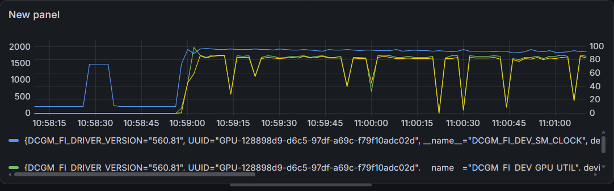
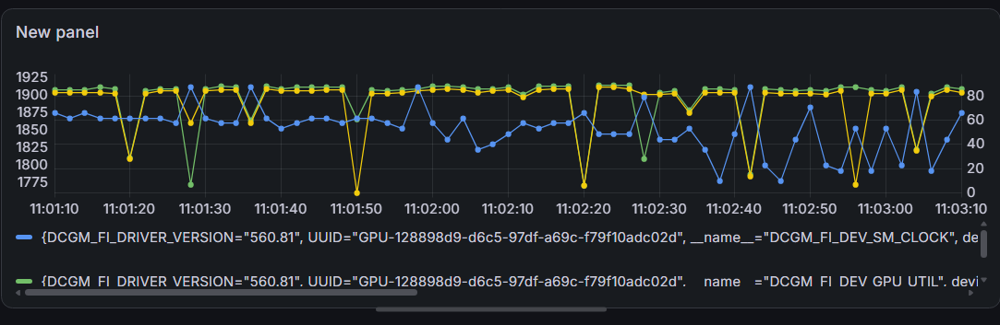
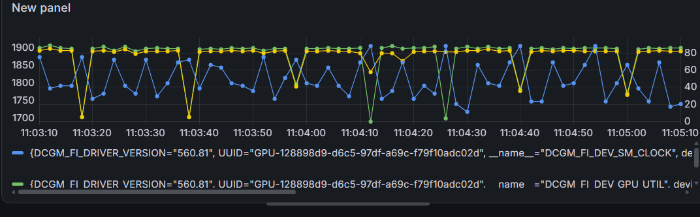
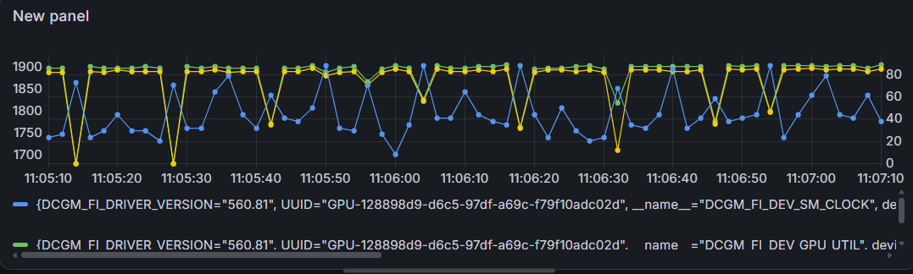
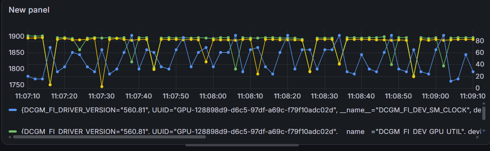
|length|concurrency|total_rounds|total_success|total_fail|overall_success_rate|p99_jitter_std|p99_range_ms|is_pass|
|--|--|--|--|--|--|--|--|--|
|16000|1|11|220|0|100.0|553.2731901426102|1876.2462|False


220 个请求全部成功，但 P99 延迟从约 2.8 秒攀升至约 4.7 秒，标准差和极差过大（553ms、1876ms），系统不稳定。
**失效模式**：长文本的 Prefill 阶段（输入处理）在短时间内产生极高 GPU 负载，温度迅速升至 85°C 温度墙，触发降频，后续性能持续恶化。


**16000文本长度5分钟测试（等待电脑冷却后）**
| golden_length | golden_concurrency | total_rounds | total_success | total_fail | overall_success_rate | p99_jitter_std | p99_range_ms | is_pass | avg_latency_ms | token_throughput |
|--------------:|-------------------:|-------------:|--------------:|-----------:|---------------------:|---------------:|-------------:|---------|---------------:|-----------------:|
| 16000         | 1                  | 6            | 120           | 0          | 100.0                | 85.6213 | 254.1752 | False   | 2828.9404 | 92.9160 |

5 分钟测试的抖动明显降低（85ms），但 254ms 的极差仍超过阈值，判定为不通过，说明长文本在本机散热条件下无法稳定运行超过 5 分钟。

**短文本（2000 字符，rps最高的数值）10 分钟测试**
| golden_length | golden_concurrency | total_rounds | total_success | total_fail | overall_success_rate | p99_jitter_std | p99_range_ms | is_pass | avg_latency_ms | token_throughput |
|--------------:|-------------------:|-------------:|--------------:|-----------:|---------------------:|---------------:|-------------:|---------|---------------:|-----------------:|
| 2000          | 1                  | 13           | 260           | 0          | 100.0                | 52.6337 | 184.6244  | True    | 2482.6583| 104.9809 |

短文本10分钟测试通过。Decode（输出生成）阶段发热相对均匀，散热系统能跟上，P99抖动和极差均在阈值内。

**2000文本长度5分钟**
| golden_length | golden_concurrency | total_rounds | total_success | total_fail | overall_success_rate | p99_jitter_std | p99_range_ms | is_pass | avg_latency_ms | token_throughput |
|--------------:|-------------------:|-------------:|--------------:|-----------:|---------------------:|---------------:|-------------:|---------|---------------:|-----------------:|
| 2000          | 1                  | 7            | 140           | 0          | 100.0                | 63.3315 | 206.0699 | False   | 2428.9742| 106.7495 |

5分钟测试未通过（极差 206ms > 500ms 阈值），但数值非常接近阈值（206.07 vs 184.62），属于边界情况。10分钟测试通过说明该配置在长时间运行中反而更稳定，可能与温度达到平衡后不再剧烈波动有关。


**结论**：
- 长文本（16000 字符）受限于 Prefill 阶段的高负载，散热系统无法及时排出热量，持续运行会触发降频，**不推荐在生产环境长时间运行**。
- 短文本（2000 字符）通过 10 分钟稳定性测试，Token 吞吐量约 **105 Token/s**，可作为本机稳定运行的建议参数。
- 短文本的 Token 吞吐量（~105 Token/s）高于长文本（~93 Token/s），与 4.2.3 中 RPS 的差异趋势一致（短文本 0.43 vs 长文本 0.37），说明长文本的 Prefill 阶段额外开销确实消耗了部分计算资源。

> **关于 `is_pass` 的判断依据**：`is_pass=True` 表示 P99 延迟标准差 < 100ms 且极差 < 500ms；`is_pass=False` 表示波动超过阈值。硬件散热条件是本实验的主要限制因素。

**备份导出，接下来进入vLLM对比实验阶段**


## 五、vLLM 推理引擎部署与对比实验

> 本章目标：在相同硬件和模型下，对比 vLLM 与 Ollama 的并发性能差异。

### 5.1 前置要求
**版本信息**：
- vLLM 镜像版本：`v0.26.0`（2026-07-27 发布）
- 最新版本：`v0.27.0`（2026-08-10 发布），本次使用稳定版 v0.26.0

**硬件兼容性**：
- 显卡架构：NVIDIA Volta 或更新（RTX 3050 Ti Ampere 架构，计算能力 8.6）
- NVIDIA 驱动：>= 535.xx（当前 560.81）
- CUDA 版本：由 Docker 镜像内置（v0.26.0 内置 CUDA 12.x）

理论兼容，进行部署验证。

### 5.2 部署过程

**模型选择**

使用 `bartowski/DeepSeek-R1-Distill-Qwen-1.5B-GPTQ-Int4`（Hugging Face GPTQ 4-bit 量化版，权重约 0.8GB），与 Ollama 实验中的模型（DeepSeek-R1-Distill-Qwen-1.5B）本质相同，均为 4-bit 量化，确保对比基准一致。

**部署命令**
```bash
docker pull vllm/vllm-openai:v0.26.0

docker run --gpus all -p 8000:8000 -v ~/hf_cache:/root/.cache/huggingface --ipc=host vllm/vllm-openai:v0.26.0 --model bartowski/DeepSeek-R1-Distill-Qwen-1.5B-GPTQ-Int4 --gpu-memory-utilization 0.95 --max-num-seqs 8 --max-model-len 2048 --enforce-eager
```

**Docker 运行时参数（容器与系统交互）**

| 参数 | 值 | 作用与意义（4GB 显存环境） |
| :--- | :--- | :--- |
| `--gpus` | `all` | 将 WSL2 中所有 NVIDIA GPU（RTX 3050 Ti）分配给容器，使容器内程序可直接调用 CUDA。 |
| `-p` | `8000:8000` | 端口映射，将容器的 8000 端口映射到宿主机的 8000 端口，方便用 `curl localhost:8000` 访问服务。 |
| `-v` | `~/hf_cache:/root/.cache/huggingface` | 挂载卷，将宿主机的缓存目录映射到容器内 HuggingFace 默认缓存路径，避免每次重启重新下载模型。 |
| `--ipc` | `host` | 共享宿主机的 IPC 命名空间，允许 PyTorch 使用共享内存进行多进程通信（官方推荐参数）。 |

** vLLM 引擎参数（模型加载与显存调度）**

| 参数 | 当前值 | 作用与显存影响（RTX 3050 Ti 4GB） |
| :--- | :--- | :--- |
| `--model` | `bartowski/DeepSeek-R1-Distill-Qwen-1.5B-GPTQ-Int4` | 指定 Hugging Face 模型 ID，此为 4-bit GPTQ 量化版，模型权重约 **0.8GB**。 |
| `--gpu-memory-utilization` | `0.95` | 预分配 GPU 显存比例，`0.95` 表示占用 `4GB × 0.95 = 3.8GB`，预留约 200MB 给系统，贴近“3900MB 保险”目标。 |
| `--max-num-seqs` | `8` | 最大并发请求数，允许 8 个请求同时处理。显存占用与并发数成正比，短文本场景下安全，长文本需降为 1~2。 |
| `--max-model-len` | `2048` | 限制单请求的最大序列长度（Prompt + 生成 Tokens），设为 2048（2K）可大幅压缩 KV Cache 占用量，为并发留出显存。 |
| `--enforce-eager` | (无参数) | 强制使用 PyTorch Eager 模式，关闭 CUDA Graph 优化。牺牲少量性能（约 5~10%）但减少显存固定开销，避免 OOM。 |

** 参数权衡关系（4GB 显存下必须注意）**

显存总占用 ≈ 模型权重(0.8GB) + (max-model-len × max-num-seqs × 单Token KV占用量) + 调度开销(≈0.3GB)

| 测试场景 | 推荐参数调整 | 预期效果 |
| :--- | :--- | :--- |
| **测高并发（短文本）** | `--max-model-len 2048 --max-num-seqs 8` | 显存占满 3.8GB，并发处理能力高，吞吐量优秀。 |
| **测超长上下文（单请求）** | `--max-model-len 98000 --max-num-seqs 1` | 单请求独占显存，可支撑 98k 上下文，但并发为零。 |
| **启动 OOM 时应急** | 降低 `--max-num-seqs`（如 8→4→2），或降低 `--max-model-len`（如 2048→1024） | 释放足够显存使容器成功启动。 |

**其他可能用到的 vLLM 参数**

| 参数 | 说明 | 当前是否需要 |
| :--- | :--- | :--- |
| `--trust-remote-code` | 允许执行模型仓库中的自定义代码（如自定义建模文件）。 | 基础 Qwen2 架构无需，若报错 `XXX not in transformers` 时再加。 |
| `--dtype` | 强制计算精度（如 `float16` / `bfloat16`），量化模型通常自动选择。 | 无需手动指定。 |

gpu-memory-utilization设置为0.95大概为3.8G，防止爆显存

验证结果
```bash
curl http://localhost:8000/v1/models
```

开发Python压测脚本，准备梯度压测，找到4G显存下的性能拐点（进行中）